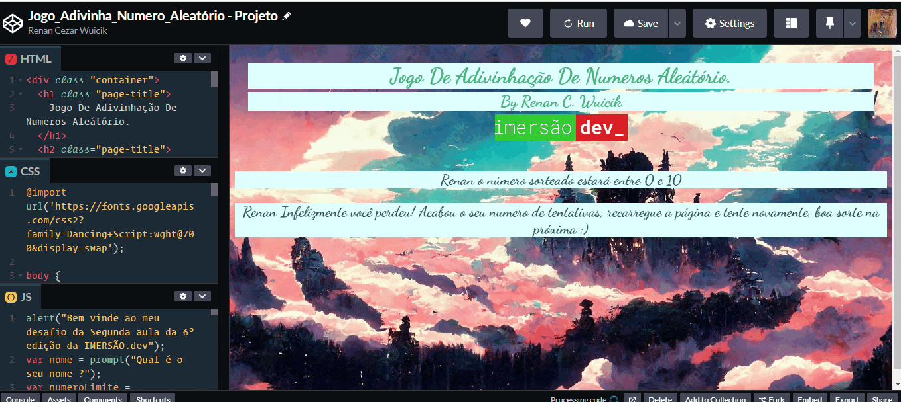

<h1 align="center"> 🤿 Alura - Imersão Dev 6 🤿 </h1>

<h2 align="center">Aula 02 - Mentalista</h2>

### Sumário 

- [Descrição](#descrição)

- [Conhecimentos adquiridos](#conhecimentos-adquiridos)

- [Desafios](#desafios)

- [Materiais complementares](#materiais-complementares)

---
## Descrição
- Na segunda aula, conhecemos um pouco mais sobre métodos para adicionar numeros aleátórios como por exemplo o `Math.random()`. Também aprendemos sobre o uso de laços de repetição e praticamos um pouco o seu uso em situações diversas.
- Também fomos desafiados á fazer um jogo de adivinhação de numeros! 

## Conhecimentos adquiridos
- Na segunda aula eu consegui praticar laços de repetição que eu já tinha certa maesria;
- Também consegui me aprofundar em como fazer conexões entre JS e HTMLx;
- Além de Aprender como usar o parâmetro ``innerHTML`` que serve para inserir algo no HTML à partir do JavaScript.

### Desafios
- [**Jogo De Adivinhação de Numeros Com Limite de Tentativas**](https://codepen.io/RenanAlura7/pen/OJwBMKp)

#### Execução:

  

## Materiais complementares
- [Strict equality (===)](https://developer.mozilla.org/en-US/docs/Web/JavaScript/Reference/Operators/Strict_equality)
- [Math.random() no MDN](https://developer.mozilla.org/pt-BR/docs/Web/JavaScript/Reference/Global_Objects/Math/random)
- [Operadores com Javascript](https://www.alura.com.br/artigos/operadores-matematicos-em-javascript)
- [Como utilizar operadores de comparação em Javascript](https://www.alura.com.br/artigos/operadores-matematicos-em-javascript)
