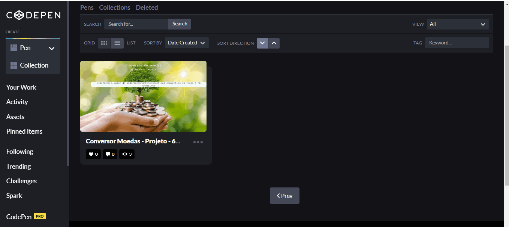

<h1 align="center"> 🤿 Alura - Imersão Dev 6° Edição 🤿 </h1>
<h2 align="center"> Aula 1 - Conversor de Unidades</h2>

### 🗃 Sumário

- [Descrição](#descrição)

- [Conhecimentos adquiridos](#conhecimentos-adquiridos)

- [Desafios](#desafios)

- [Materiais complementares](#materiais-complementares)

---
##  Descrição
- Nessa fase tivemos a primeira aula da imersão e nela fomos desafiados à desenvolver um conversor!
- Nós exercitamos o que aprendemos e buscamos ir além, e como os desafios eram um pouco subjetivos e tinham rumos diferentes, algumas pessoas optaram por fazer mais de um projeto apenas, e esse foi o meu caso também.
- Eu optei por construir 3 projetos com conteúdos diferentes. Sendo eles:
  - Conversor de Moedas Estrangeiras Em Real;
  - Conversor de Unidades diversas;
  - Conversos de Bitcoin em real e vice e versa.

## Conhecimentos adquiridos
- Nessa fase eu pude praticar meus conhecimentos em JavaScript;
- Consegui aprender sobre o funcionamento de referenciação de objetos feitos no JS colocados dentro do HTML;
- Pude praticar a implementação de contas dentro do JavaScript.

## Desafios
- [**Conversor de moedas**](https://codepen.io/RenanAlura7/pen/zYLJoKO);
- [**Conversor de Unidades**](https://codepen.io/RenanAlura7/pen/WNKgXxV);
- [**Conversor De Bitcoin**](https://codepen.io/RenanAlura7/pen/OJwoEdw);

#### Execução:

  

## Materiais complementares
- [JavaScript segundo a documentação](https://developer.mozilla.org/pt-BR/docs/Web/JavaScript)
- [Primeiros passos na programação](https://hipsters.tech/primeiros-passos-na-programacao-a-imersao-dev-hipsters-ponto-tech-243/)
- [O que é Javascript?](https://www.youtube.com/watch?v=NaVSbnnV75Q)
- [Evolução do Javascript](https://www.youtube.com/watch?v=Bmw_6oOvO3s)
